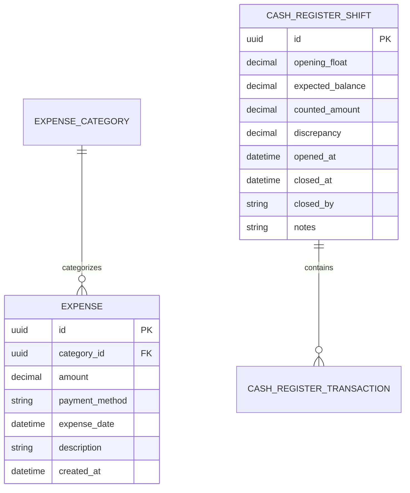

# Feature Specification: 006-expenses-cash-drawer

**Feature Name**: Daily Expenses, Custom Expense Categories & Cash Drawer (Register Shift) Reconciliation  
**Target Module**: RetailOS Frontend & Operations Backend  
**Status**: Ready for Planning  
**Version**: 1.0.0  

---

## 1. Executive Summary & Business Value

In retail operations, unmonitored petty cash and unaccounted operating expenses (rent, electricity, salaries, consumables, hospitality) lead to hidden financial leakage and false profit margins. Furthermore, shift handovers without strict cash drawer (درج الكاشير) counting cause end-of-day cash discrepancies (عجز أو زيادة في النقدية).

This feature equips store owners and managers with:
1. **Daily Operational Expenses Management**: Categorized recording of store expenditures (Cash / Bank Transfer / Cheque), with custom category creation and date/category filtration.
2. **Cash Drawer & Register Shift Control**:
   - **Opening Float (عهدة بداية الوردية / رصيد افتتاحي)** initialization.
   - **Live Inflow & Outflow Tracking**: Real-time aggregation of cash sales (+), customer debt cash repayments (+), cash expenses (-), and supplier debt cash disbursements (-).
   - **End-of-Day Shift Close & Reconciliation (تقفيل الوردية وجرد الدرج)**: Cashier/Manager enters physical counted cash, and the system automatically calculates discrepancies (Surplus/Deficit), recording the closure with notes and timestamped audit logs.

---

## 2. User Personas & Roles

| Persona | Role | Permissions & Responsibilities |
|---------|------|---------------------------------|
| **Store Owner** | `Owner` | Full visibility across all expenses, categories creation, drawer opening/closing, and financial discrepancy audits. |
| **Store Manager** | `Manager` | Full management of daily expenses, category addition, and performing shift openings and closings. |
| **Cashier** | `Cashier` | Views current cash drawer status and records daily petty cash expenses within allowed operational limits. |

---

## 3. User Stories & Acceptance Scenarios

### User Story 1: Record Operating Expense
> **As a** Store Manager or Owner,  
> **I want to** quickly record a store expense with amount, category, payment method, date, and notes,  
> **So that** all operating costs are deducted from daily net profit and tracked accurately.

- **Acceptance Scenario 1.1 (Valid Cash Expense)**:
  - User selects category (e.g. "فواتير ومرافق - كهرباء"), enters amount (e.g. 350 EGP), selects payment method "نقدي (من الدرج)", and submits.
  - Expense is saved, instantly reflected in the expenses table, and live cash drawer balance decreases by 350 EGP.
- **Acceptance Scenario 1.2 (Non-Cash Expense)**:
  - User records a salary payment of 5,000 EGP via "تحويل بنكي / فودافون كاش".
  - Expense is logged in reports/expenses, but physical cash drawer balance remains unchanged.

### User Story 2: Manage Expense Categories
> **As a** Store Owner,  
> **I want to** create custom expense categories with custom descriptions,  
> **So that** expenses can be organized logically for accounting reports.

- **Acceptance Scenario 2.1**: User clicks "إضافة قسم مصروفات", enters "بوفيه وضيافة", and saves. The new category is immediately selectable in expense forms and filters.

### User Story 3: Cash Drawer Shift Initialization (Opening Float)
> **As a** Store Manager,  
> **I want to** open the cash drawer session with an initial opening float (عهدة البداية / الفكة),  
> **So that** the register starts with the exact physical starting cash.

- **Acceptance Scenario 3.1**: User clicks "فتح الوردية / عهدة البداية", enters 500 EGP, adds notes "فكة صباحية", and confirms. Current drawer balance becomes 500 EGP and shift is marked active.

### User Story 4: Live Cash Drawer Balance & Movement Audit
> **As a** Store Owner,  
> **I want to** view live cash inflows and outflows in real-time,  
> **So that** I know exactly how much cash should be physically inside the drawer at any given second.

- **Acceptance Scenario 4.1**: User opens "درج الكاشير والتسوية", sees:
  - Opening Float: +500 EGP
  - Cash Sales: +3,200 EGP
  - Customer Cash Debt Collection: +800 EGP
  - Cash Expenses: -250 EGP
  - Supplier Cash Debt Payments: -1,000 EGP
  - Expected Drawer Balance: 3,250 EGP.
- **Acceptance Scenario 4.2**: Timeline table lists each transaction chronologically with type, timestamp, amount, and notes.

### User Story 5: End-of-Day Shift Close & Physical Reconciliation
> **As a** Store Manager or Owner,  
> **I want to** count the physical cash in the drawer and record register closure,  
> **So that** discrepancies (Deficit / Surplus / Balanced) are permanently audited.

- **Acceptance Scenario 5.1 (Balanced Closure)**: Expected = 3,250 EGP. User enters 3,250 EGP. Discrepancy is 0.00 EGP ("مطابق تماماً"). Shift closes successfully.
- **Acceptance Scenario 5.2 (Shortage / عجز)**: Expected = 3,250 EGP. User enters 3,200 EGP. Discrepancy is -50.00 EGP ("عجز في النقدية"). User enters reason in notes and confirms closure. Discrepancy is highlighted in red in closing summary.
- **Acceptance Scenario 5.3 (Surplus / زيادة)**: Expected = 3,250 EGP. User enters 3,300 EGP. Discrepancy is +50.00 EGP ("زيادة في النقدية"). System records surplus with green badge.

---

## 4. Functional Requirements

1. **Expenses Directory & Filtration**:
   - Tabular view of expenses with pagination, total expenses KPI, date range filter (`from` - `to`), and category filter.
   - Quick search by expense description or category name.
2. **Record Expense Form**:
   - Fields: Amount (`decimal > 0`), Category (`select`), Payment Method (`Cash`, `BankTransfer`, `Cheque`), Expense Date (`date`), Notes/Description (`optional string`).
   - Client-side validation with instant Arabic error hints.
3. **Expense Categories Modal**:
   - Quick-add modal for new category with Name (`required`) and Description (`optional`).
4. **Cash Drawer Live Dashboard**:
   - Metric cards: Current Calculated Balance, Opening Float, Total Today Cash Inflows, Total Today Cash Outflows.
   - Shift status badge (مفتوحة / مغلقة).
5. **Shift Operations**:
   - Open Float Modal with amount and optional notes.
   - Close Register Modal with expected balance preview, physical counted cash input, automatic discrepancy calculation, and mandatory explanation note if discrepancy != 0.
6. **Cash Drawer Transactions Log**:
   - Chronological table showing Date, Type (Opening Float, Sale, Customer Payment, Expense, Supplier Payment, Shift Close), Amount, Reference, and Notes.

---

## 5. Success Criteria & Quality Metrics

1. **Zero Discrepancy Ambiguity**: System must clearly distinguish between physical cash movements and electronic/credit payments.
2. **Instant Cash Calculation**: Calculated drawer balance updates immediately upon recording any cash transaction without page refresh.
3. **Sub-second Filter & Search**: Expenses search and date-range filtering responds within < 100ms.
4. **Accessibility & RTL Polish**: High-contrast badges for cash status (Green for Surplus, Red for Deficit, Slate for Balanced), with Arabic number formatting.
5. **Role-based Security**: Only authorized users (`Owner`, `Manager`) can open/close shifts and view full financial logs.

---

## 6. Key Entities & Data Schema

---

## 7. Assumptions & Boundaries

- Expenses recorded as `Cash` automatically affect the active store's cash drawer balance in the backend.
- Deleting historical expenses is restricted or audited to prevent fraud.
- Reconciled shifts cannot be re-opened; a new shift session must be initiated with a new opening float.
