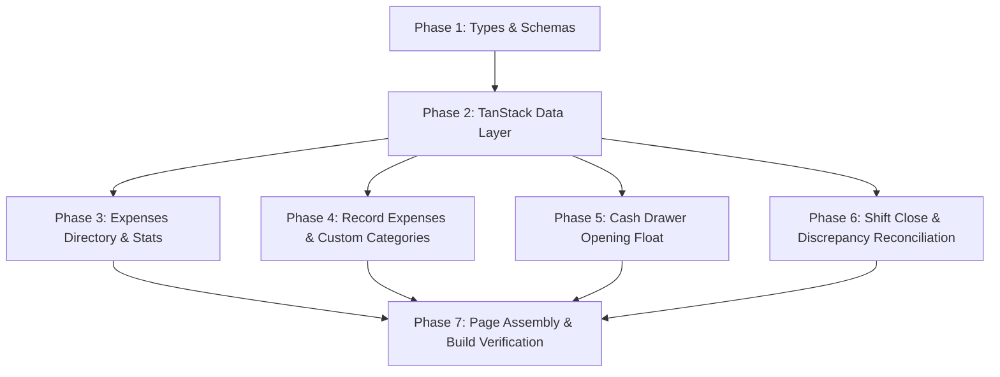

# Implementation Tasks: 006-expenses-cash-drawer

**Feature**: Daily Expenses, Custom Expense Categories & Cash Drawer (Register Shift) Reconciliation  
**Target Module**: RetailOS Frontend (`system-FE`)  
**Specification**: [spec.md](./spec.md)  
**Implementation Plan**: [plan.md](./plan.md)  

---

## Task Dependencies & Phase Progression

---

## Phase 1: Setup & Contracts

- [x] T001 Create TypeScript types and interfaces in `src/features/expenses/types/expenses.types.ts`
- [x] T002 [P] Create Zod validation schemas in `src/features/expenses/types/expenses.schemas.ts`

---

## Phase 2: Foundational Data Layer

- [x] T003 Implement TanStack queries in `src/features/expenses/api/useExpensesQueries.ts`
- [x] T004 Implement TanStack mutations with cache invalidation in `src/features/expenses/api/useExpensesMutations.ts`

---

## Phase 3: User Story 1 - Expenses Directory & KPI Summaries

- [x] T005 [P] [US1] Build `src/features/expenses/components/ExpensesHeader.tsx` with live drawer balance and KPI cards
- [x] T006 [P] [US1] Build `src/features/expenses/components/ExpensesFilterBar.tsx` with date range and category filters
- [x] T007 [US1] Build `src/features/expenses/components/ExpensesTable.tsx` with pagination and payment method badges

---

## Phase 4: User Story 2 - Record Expenses & Custom Categories

- [x] T008 [P] [US2] Build `src/features/expenses/components/RecordExpenseModal.tsx` with drawer deduction hints
- [x] T009 [P] [US2] Build `src/features/expenses/components/ExpenseCategoryModal.tsx` for creating custom categories

---

## Phase 5: User Story 3 - Cash Drawer Opening Float Session

- [x] T010 [US3] Build `src/features/expenses/components/OpenFloatModal.tsx` for starting session float

---

## Phase 6: User Story 4 - End-of-Day Shift Close & Discrepancy Reconciliation

- [x] T011 [US4] Build `src/features/expenses/components/CloseRegisterModal.tsx` with live counted cash discrepancy calculation
- [x] T012 [P] [US4] Build `src/features/expenses/components/CashDrawerHistoryModal.tsx` for shift transactions timeline

---

## Phase 7: User Story 5 - Page Assembly & Build Verification

- [x] T013 [US5] Assemble unified page in `src/pages/Expenses.tsx` connecting all components and modals
- [x] T014 Run frontend build validation (`npm run build`) to ensure 0 TypeScript and bundling errors
