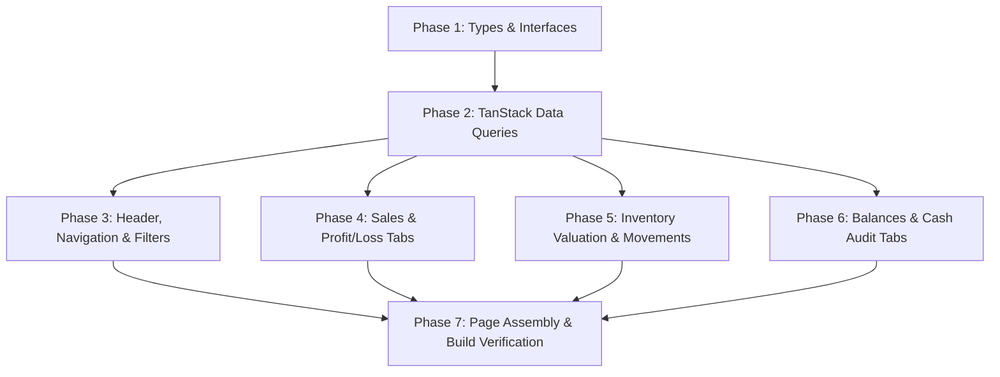

# Implementation Tasks: 007-reports-analytics

**Feature**: Comprehensive Financial, Sales, Inventory Valuation & Cash Audit Reports  
**Target Module**: RetailOS Frontend (`system-FE`)  
**Specification**: [spec.md](./spec.md)  
**Implementation Plan**: [plan.md](./plan.md)  

---

## Task Dependencies & Phase Progression

---

## Phase 1: Setup & Contracts

- [x] T001 Create TypeScript models and response types in `src/features/reports/types/reports.types.ts`

---

## Phase 2: Foundational Data Layer

- [x] T002 Implement TanStack query hooks in `src/features/reports/api/useReportsQueries.ts`

---

## Phase 3: User Story 1 - Header, Navigation & Date Filters

- [x] T003 [P] [US1] Build `src/features/reports/components/ReportsHeader.tsx` with date presets, print and CSV export triggers
- [x] T004 [P] [US1] Build `src/features/reports/components/ReportsTabNavigation.tsx` with active tab indicators

---

## Phase 4: User Story 2 - Sales & Profit/Loss Reports

- [x] T005 [P] [US2] Build `src/features/reports/components/SalesReportTab.tsx` with order analytics and payment methods breakdown
- [x] T006 [P] [US2] Build `src/features/reports/components/ProfitLossReportTab.tsx` with income statement and expense category distribution

---

## Phase 5: User Story 3 - Inventory Valuation & Stock Movement

- [x] T007 [P] [US3] Build `src/features/reports/components/InventoryValuationReportTab.tsx` with WAC cost and potential revenue
- [x] T008 [P] [US3] Build `src/features/reports/components/ProductMovementModal.tsx` for stock movement drilldown

---

## Phase 6: User Story 4 & 5 - Balances & Cash Register Audits

- [x] T009 [P] [US4] Build `src/features/reports/components/BalancesReportTab.tsx` for customer receivables and supplier payables
- [x] T010 [P] [US5] Build `src/features/reports/components/CashRegisterAuditTab.tsx` for shift discrepancies and daily cash flow

---

## Phase 7: Page Assembly & Build Verification

- [x] T011 Assemble `src/pages/Reports.tsx` connecting all report tabs with print optimization styles
- [x] T012 Run frontend build validation (`npm run build`) to ensure 0 TypeScript and bundling errors
