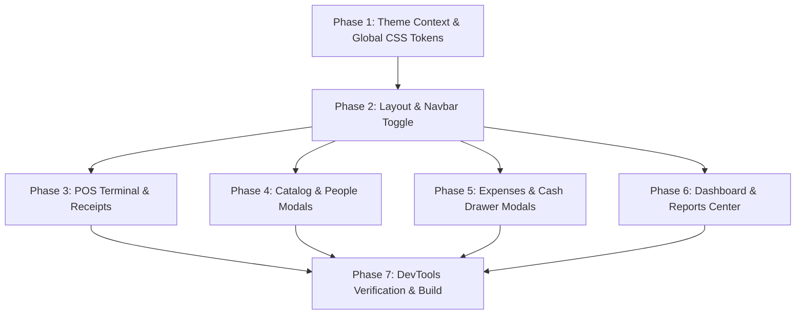

# Implementation Tasks: 008-ui-ux-polish-qa

**Feature**: Comprehensive UI/UX Testing, Theme & Color Contrast Standardization, Edge Cases & Visual Polish  
**Target Module**: RetailOS Frontend (`system-FE`)  
**Specification**: [spec.md](./spec.md)  
**Implementation Plan**: [plan.md](./plan.md)  

---

## Task Dependencies & Phase Progression

---

## Phase 1: Setup & Theme System Foundation

- [X] T001 Implement `src/context/ThemeContext.tsx` with `ThemeProvider`, `useTheme()`, `localStorage` persistence, and dynamic root `dark` class synchronization
- [X] T002 Upgrade `src/index.css` with global WCAG AA/AAA design tokens, high-contrast inputs, selects, textareas, cards, and scrollbars in both Light and Dark themes

---

## Phase 2: Navigation & Global Overlays

- [X] T003 [P] [US1] Add Dark/Light mode toggle switch to `src/components/layout/Navbar.tsx` and ensure high contrast for cashier shift badge and drawer balance indicator
- [X] T004 [P] [US1] Upgrade `src/components/layout/Sidebar.tsx` with high-contrast active link highlights, store badges, and collapse animations

---

## Phase 3: POS Terminal & Thermal Receipts (US2)

- [X] T005 [P] [US2] Upgrade contrast in POS catalog, cart item controls, and payment modal in `src/features/pos/components/PaymentModal.tsx` and `src/pages/Pos.tsx`
- [X] T006 [P] [US2] Guarantee `src/features/pos/components/ReceiptModal.tsx` preserves pure white thermal paper with crisp black text in both Light and Dark themes

---

## Phase 4: Catalog & People Modals (US3)

- [X] T007 [P] [US3] Upgrade contrast and form inputs in `src/features/products/components/ProductModal.tsx` (profit margin calculator) and `src/pages/Products.tsx`
- [X] T008 [P] [US3] Upgrade contrast, debt badges, and statement ledgers in `src/features/customers/` components and `src/pages/Customers.tsx`
- [X] T009 [P] [US3] Upgrade contrast, sticky action footers, and multi-item purchase tables in `src/features/suppliers/` components and `src/pages/Suppliers.tsx`

---

## Phase 5: Financial Operations & Cash Register (US4)

- [X] T010 [P] [US4] Upgrade contrast, live discrepancy indicators, and sticky action footers across `src/features/expenses/` components and `src/pages/Expenses.tsx`

---

## Phase 6: Executive Dashboard & Reports Center (US5)

- [X] T011 [P] [US5] Upgrade contrast in `src/pages/Dashboard.tsx` (KPI cards, sales trend area chart tooltips, bestsellers, and stock alerts)
- [X] T012 [P] [US5] Upgrade contrast across all report tabs in `src/features/reports/` and `src/pages/Reports.tsx` with print optimization styles (`@media print`)

---

## Phase 7: DevTools Verification & Build Validation

- [X] T013 Verify interactive states (`:focus`, `:hover`, `:disabled`, validation errors) and audit color contrast ratios using Chrome DevTools Color Picker
- [X] T014 Run frontend build validation (`npm run build`) to ensure 0 TypeScript and bundling errors
