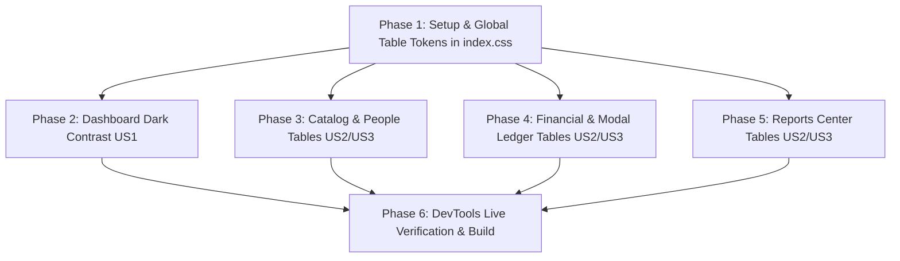

# Implementation Tasks: 009-table-hover-dark-contrast

**Feature**: Table Header & Hover Dark Mode Contrast Standardization  
**Target Module**: RetailOS Frontend (`system-FE`)  
**Specification**: [spec.md](./spec.md)  
**Implementation Plan**: [plan.md](./plan.md)  

---

## Task Dependencies & Phase Progression

---

## Phase 1: Setup & Global Table Design Tokens

- [X] T001 Implement standardized high-contrast `.table-header` and `.table-row-hover` utility classes in `src/index.css`

---

## Phase 2: Dashboard Dark Mode Contrast (US1)

- [X] T002 [US1] Update activity timeline event titles and identifiers in `src/pages/Dashboard.tsx` to high-contrast `text-slate-900 dark:text-white` and `text-slate-600 dark:text-slate-300`
- [X] T003 [US1] Update stock shortage alerts, dead stock, and bestsellers cards in `src/pages/Dashboard.tsx` to `dark:text-white` and `dark:divide-slate-700`

---

## Phase 3: Catalog & People Tables (US2 & US3)

- [X] T004 [P] [US2] [US3] Standardize table header and row hover contrast in `src/features/products/components/ProductsTable.tsx`
- [X] T005 [P] [US2] [US3] Standardize table header and row hover contrast in `src/features/customers/components/CustomersTable.tsx`
- [X] T006 [P] [US2] [US3] Standardize table header and row hover contrast in `src/features/suppliers/components/SuppliersTable.tsx`

---

## Phase 4: Financial & Modal Ledger Tables (US2 & US3)

- [X] T007 [P] [US2] [US3] Standardize table header and row hover contrast in `src/features/expenses/components/ExpensesTable.tsx`
- [X] T008 [P] [US2] [US3] Standardize table headers and row hover contrast in `src/features/customers/components/CustomerStatementModal.tsx` and `src/features/suppliers/components/SupplierStatementModal.tsx`
- [X] T009 [P] [US2] [US3] Standardize table headers and row hover contrast in `src/features/suppliers/components/CreatePurchaseModal.tsx`, `src/features/expenses/components/CashDrawerHistoryModal.tsx`, and `src/features/reports/components/ProductMovementModal.tsx`

---

## Phase 5: Reports Center Tables (US2 & US3)

- [X] T010 [P] [US2] [US3] Standardize table headers and row hover in all 5 reports tabs (`src/features/reports/components/SalesReportTab.tsx`, `ProfitLossReportTab.tsx`, `InventoryValuationReportTab.tsx`, `BalancesReportTab.tsx`, `CashRegisterAuditTab.tsx`)

---

## Phase 6: Live Chrome DevTools Verification & Build Validation

- [X] T011 Verify Dashboard activity timeline and stock alerts in Dark Mode using Chrome DevTools script evaluation and screenshot capture
- [X] T012 Verify table header contrast and row hover state in Dark Mode using Chrome DevTools across Products, Customers, Suppliers, Expenses, and Reports
- [X] T013 Run frontend build validation (`npm run build`) in `system-FE` to ensure 0 TypeScript and bundling errors
