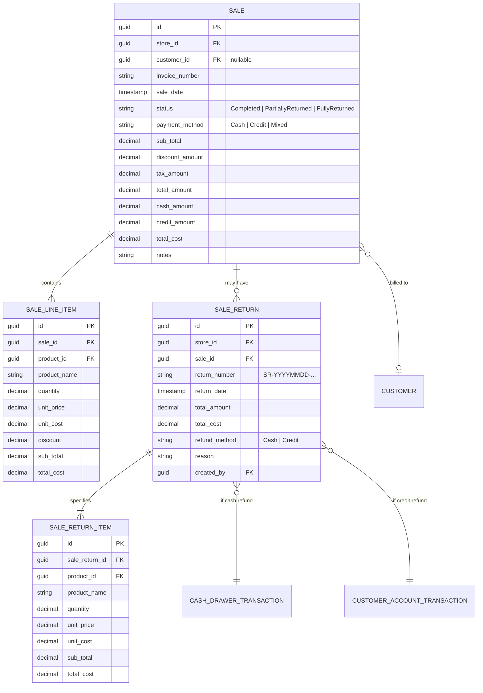

# Data Model: Sales Invoices History & Returns Management

**Feature**: `010-sales-history-returns`  
**Date**: 2026-09-06  
**Status**: Completed

---

## 1. Core Entities & Relationships



---

## 2. Frontend TypeScript Interfaces

```typescript
// src/features/sales/types/sales.types.ts

export type SalePaymentMethod = 'Cash' | 'Credit' | 'Mixed';

export type SaleStatus = 'Completed' | 'PartiallyReturned' | 'FullyReturned' | 'Cancelled';

export type RefundMethod = 'Cash' | 'Credit';

export interface SaleLineItem {
  id: string;
  productId: string;
  productName: string;
  quantity: number;
  unitPrice: number;
  unitCost: number;
  discount: number;
  subTotal: number;
  totalCost: number;
  previouslyReturnedQuantity?: number;
}

export interface Sale {
  id: string;
  customerId?: string | null;
  customerName?: string | null;
  invoiceNumber: string;
  saleDate: string;
  status: string;
  paymentMethod: SalePaymentMethod;
  subTotal: number;
  discountAmount: number;
  taxAmount: number;
  totalAmount: number;
  cashAmount: number;
  creditAmount: number;
  totalCost: number;
  notes?: string | null;
  createdAt: string;
  items: SaleLineItem[];
  returns?: SaleReturn[];
}

export interface SaleListResponse {
  items: Sale[];
  totalCount: number;
  pageNumber: number;
  pageSize: number;
}

export interface SaleReturnItemRequest {
  productId: string;
  quantity: number;
}

export interface CreateSaleReturnRequest {
  reason: string;
  refundMethod: RefundMethod;
  items: SaleReturnItemRequest[];
}

export interface SaleReturnItemResponse {
  id: string;
  productId: string;
  productName: string;
  quantity: number;
  unitPrice: number;
  unitCost: number;
  subTotal: number;
  totalCost: number;
}

export interface SaleReturn {
  id: string;
  saleId: string;
  returnNumber: string;
  returnDate: string;
  totalAmount: number;
  totalCost: number;
  refundMethod: RefundMethod;
  reason: string;
  items: SaleReturnItemResponse[];
}

export interface ReturnFormItemState {
  productId: string;
  productName: string;
  unitPrice: number;
  purchasedQty: number;
  returnedQty: number;
  returnableQty: number;
  selectedQty: number;
  isSelected: boolean;
}
```

---

## 3. State Transitions & Invariants

### Invoice Return Status Transitions:
1. **`Completed`** (Default): Invoice has been paid and finalized. No items have been returned.
2. **`PartiallyReturned`**: At least one line item has had `quantity > 0` returned, but `totalReturnedUnits < totalPurchasedUnits`.
3. **`FullyReturned`**: All units of all line items have been returned (`totalReturnedUnits === totalPurchasedUnits`). Return button is disabled.

### Validation Invariants:
- `returnableQty = item.quantity - previouslyReturnedQty`
- `0 < returnItem.quantity <= returnableQty`
- If `refundMethod === 'Credit'`, `sale.customerId` MUST NOT be null.
- If `refundMethod === 'Cash'`, cash register session MUST be open and active.
