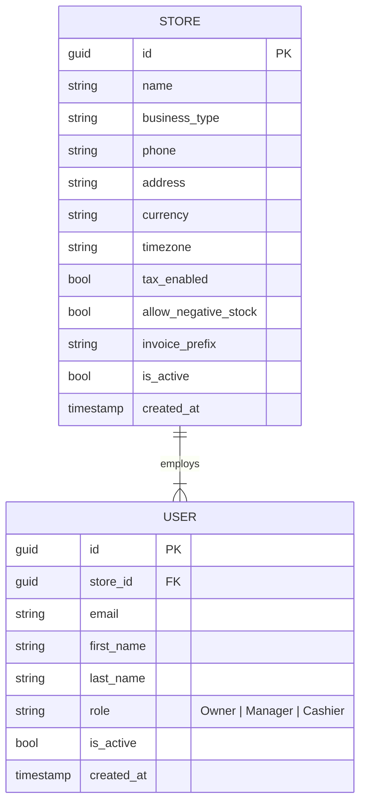

# Data Model: Users Management & Store Settings

**Feature**: `011-users-store-settings`  
**Date**: 2026-09-09  
**Status**: Completed

---

## 1. Core Entities & Relationships



---

## 2. Frontend TypeScript Interfaces

```typescript
// src/features/settings/types/settings.types.ts

export type UserRole = 'Owner' | 'Manager' | 'Cashier';

export interface StoreUser {
  id: string;
  email: string;
  firstName: string;
  lastName: string;
  role: UserRole;
  isActive: boolean;
  storeId: string;
  createdAt: string;
}

export interface UserListResponse {
  items: StoreUser[];
  totalCount: number;
  page: number;
  pageSize: number;
}

export interface CreateUserRequest {
  firstName: string;
  lastName: string;
  email: string;
  password: string;
  role: UserRole;
}

export interface UpdateUserRequest {
  firstName: string;
  lastName: string;
  role: UserRole;
}

export interface StoreProfile {
  id: string;
  name: string;
  businessType: string;
  phone?: string | null;
  address?: string | null;
  currency: string;
  timezone: string;
  taxEnabled: boolean;
  allowNegativeStock: boolean;
  invoicePrefix?: string | null;
  isActive: boolean;
  createdAt: string;
}

export interface UpdateStoreRequest {
  name: string;
  phone?: string | null;
  address?: string | null;
  taxEnabled: boolean;
  allowNegativeStock: boolean;
  invoicePrefix?: string | null;
  currency?: string;
  timezone?: string;
}
```

---

## 3. State Transitions & Invariants

### User Account Lifecycle:
1. **Creation**: User is registered with `isActive = true`. Role is assigned (`Cashier` or `Manager`).
2. **Deactivation**: Single-click toggle switches `isActive` to `false`. Deactivated user cannot log in.
3. **Activation**: Single-click toggle switches `isActive` to `true`.
4. **Permanent Retention**: Hard deletion is prohibited to preserve referential integrity of historical POS sales, returns, expenses, and cash drawers.

### Store Configuration Invariants:
- `name`: Required, max length 200 characters.
- `currency`: Default `"EGP"`.
- `timezone`: Default `"Africa/Cairo"`.
- `taxEnabled`: Controls whether POS auto-calculates 14% VAT.
- `allowNegativeStock`: Controls whether cashier can sell products with zero inventory.
