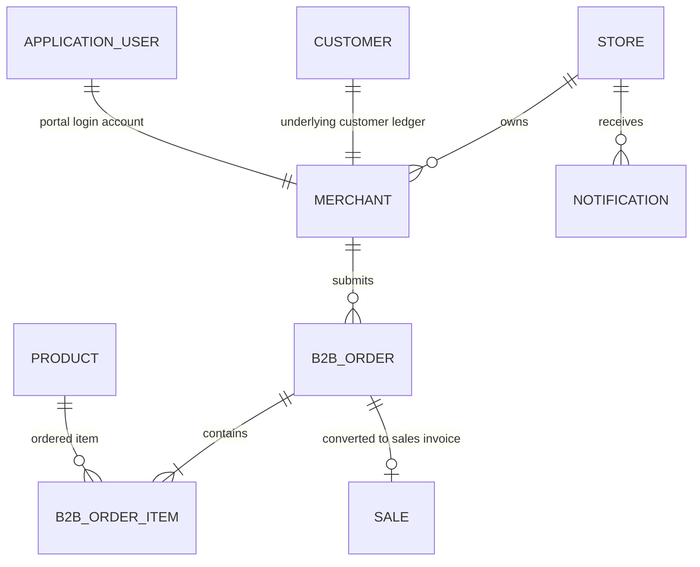
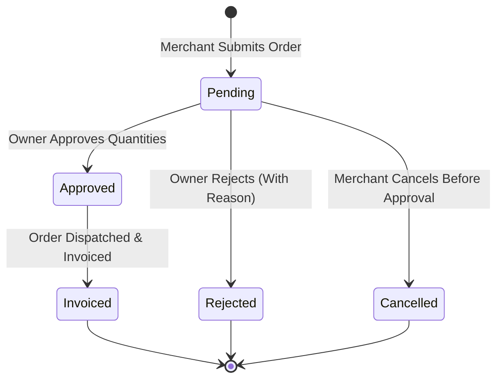

# Data Model: B2B Wholesale Orders & Multi-channel Notifications

**Feature**: `012-b2b-wholesale-portal`  
**Date**: 2026-09-09  
**Status**: Completed

---

## 1. Relational Schema & Entities

### Existing Entity Extension: `Product` (`products` table)
Modifications to support wholesale pricing and catalog gating:

| Column Name | Type | Nullable | Description & Constraints |
|---|---|---|---|
| `wholesale_price` | `numeric(19,4)` | Yes | Explicit optional wholesale unit price (>= 0). If null, fallback to `selling_price`. |
| `is_wholesale_available` | `boolean` | No | Flag indicating if product appears in wholesale B2B catalog (Default: false). |

---

### Entity: `Merchant` (`merchants` table)
Represents a B2B wholesale client / retail shop.

| Column Name | Type | Nullable | Description & Constraints |
|---|---|---|---|
| `id` | `uuid` | No | Primary Key (Default: gen_random_uuid()) |
| `store_id` | `uuid` | No | Multi-tenant Foreign Key to `stores(id)` with Index |
| `customer_id` | `uuid` | No | Foreign Key to `customers(id)` for accounting ledger |
| `user_id` | `uuid` | No | Foreign Key to `AspNetUsers(id)` for portal authentication |
| `trade_name` | `varchar(150)` | No | Commercial / Shop Name (e.g. "محل الأمل للتجزئة") |
| `contact_person` | `varchar(100)` | No | Name of the shopkeeper / representative |
| `phone` | `varchar(30)` | No | Phone / WhatsApp contact |
| `email` | `varchar(150)` | Yes | Email address for order invoices and notifications |
| `address` | `varchar(250)` | Yes | Physical delivery address |
| `credit_limit` | `numeric(19,4)` | No | Maximum allowed credit debt (Default: 0.00) |
| `payment_terms` | `varchar(50)` | Yes | E.g. "Net 15", "Net 30", "Cash on Delivery" |
| `is_active` | `boolean` | No | Account status (Default: true) |
| `created_at` | `timestamptz` | No | Creation timestamp (Default: now()) |
| `updated_at` | `timestamptz` | Yes | Last update timestamp |

---

### Entity: `B2BOrder` (`b2b_orders` table)
Represents a wholesale purchase order placed by a merchant.

| Column Name | Type | Nullable | Description & Constraints |
|---|---|---|---|
| `id` | `uuid` | No | Primary Key |
| `store_id` | `uuid` | No | Multi-tenant Foreign Key to `stores(id)` with Index |
| `merchant_id` | `uuid` | No | Foreign Key to `merchants(id)` |
| `order_number` | `varchar(50)` | No | Unique human-readable code (e.g. `B2B-1001`) |
| `status` | `varchar(30)` | No | `Pending`, `Approved`, `Invoiced`, `Rejected`, `Cancelled` |
| `payment_preference` | `varchar(30)` | No | `Cash`, `Credit`, `Partial` |
| `total_amount` | `numeric(19,4)` | No | Total wholesale price of all ordered items |
| `paid_amount` | `numeric(19,4)` | No | Down-payment amount paid at dispatch (Default: 0.00) |
| `remaining_amount` | `numeric(19,4)` | No | Balance debited on credit (Default: 0.00) |
| `notes` | `varchar(500)` | Yes | Merchant delivery instructions |
| `rejection_reason` | `varchar(300)` | Yes | Explanatory note if rejected |
| `cancelled_at` | `timestamptz` | Yes | Cancellation timestamp |
| `cancelled_by_user_id` | `uuid` | Yes | Foreign Key to `AspNetUsers(id)` who cancelled |
| `cancellation_reason` | `varchar(300)` | Yes | Optional merchant cancellation reason |
| `is_credit_limit_override_used` | `boolean` | No | True if credit limit was exceeded and overridden (Default: false) |
| `credit_limit_override_reason` | `varchar(500)` | Yes | Mandatory audit reason if override used (10-500 chars) |
| `credit_limit_override_by_user_id` | `uuid` | Yes | Foreign Key to `AspNetUsers(id)` who approved override |
| `credit_limit_override_at` | `timestamptz` | Yes | Timestamp of override approval |
| `credit_limit_at_invoice` | `numeric(19,4)` | Yes | Snapshot of Customer.CreditLimit at invoicing |
| `outstanding_balance_at_invoice` | `numeric(19,4)` | Yes | Snapshot of ledger balance before invoice |
| `credit_amount_at_invoice` | `numeric(19,4)` | Yes | Unpaid invoice portion added to debt |
| `projected_balance_at_invoice` | `numeric(19,4)` | Yes | Sum of balance and new credit amount |
| `credit_limit_exceeded_by` | `numeric(19,4)` | Yes | `projected_balance - credit_limit` |
| `sales_invoice_id` | `uuid` | Yes | Foreign Key to `sales(id)` once converted |
| `created_at` | `timestamptz` | No | Order placement timestamp |
| `updated_at` | `timestamptz` | Yes | Status change timestamp |

---

### Entity: `B2BOrderItem` (`b2b_order_items` table)
Line items inside each B2B order.

| Column Name | Type | Nullable | Description & Constraints |
|---|---|---|---|
| `id` | `uuid` | No | Primary Key |
| `b2b_order_id` | `uuid` | No | Foreign Key to `b2b_orders(id)` (Cascade delete with order) |
| `product_id` | `uuid` | No | Foreign Key to `products(id)` |
| `product_name` | `varchar(150)` | No | Snapshot of product name at ordering time |
| `requested_quantity` | `numeric(19,4)` | No | Immutable quantity requested by merchant (> 0) |
| `approved_quantity` | `numeric(19,4)` | Yes | Quantity approved by Owner/Manager (null until approved) |
| `unit_wholesale_price` | `numeric(19,4)` | No | Unit wholesale price snapshot at order placement |
| `requested_subtotal` | `numeric(19,4)` | No | `requested_quantity * unit_wholesale_price` |
| `approved_subtotal` | `numeric(19,4)` | Yes | `approved_quantity * unit_wholesale_price` |
| `adjustment_reason` | `varchar(300)` | Yes | Required if `approved_quantity < requested_quantity` |
| `adjusted_by_user_id` | `uuid` | Yes | Foreign Key to `AspNetUsers(id)` who adjusted |
| `adjusted_at` | `timestamptz` | Yes | Timestamp of quantity adjustment |

---

### Entity: `Notification` (`notifications` table)
Persistent in-app notifications log.

| Column Name | Type | Nullable | Description & Constraints |
|---|---|---|---|
| `id` | `uuid` | No | Primary Key |
| `store_id` | `uuid` | No | Multi-tenant Foreign Key to `stores(id)` with Index |
| `recipient_user_id` | `uuid` | Yes | Target user ID (null if broad store alert) |
| `title` | `varchar(150)` | No | E.g. "طلب توريد جديد" |
| `message` | `varchar(300)` | No | E.g. "طلب #B2B-1001 من محل الأمل بقيمة 12,500 ج.م" |
| `notification_type` | `varchar(50)` | No | `B2BOrderCreated`, `B2BOrderApproved`, `B2BOrderRejected` |
| `reference_id` | `varchar(100)` | Yes | E.g. B2B Order Id |
| `is_read` | `boolean` | No | Read status (Default: false) |
| `created_at` | `timestamptz` | No | Timestamp |

---

## 2. State Machine: B2B Order Status Transitions

- **Pending → Approved**: Validates stock availability.
- **Approved → Invoiced**:
  - Atomic transaction:
    1. Create `Sale` record with payment breakdown.
    2. Centralized Inventory decrement (`CentralizedInventoryService.RecordTransactionAsync`).
    3. Update `customer_account_transactions` with debit balance.
    4. Link `B2BOrder.SalesInvoiceId = sale.Id`.
    5. Update `B2BOrder.Status = "Invoiced"`.
