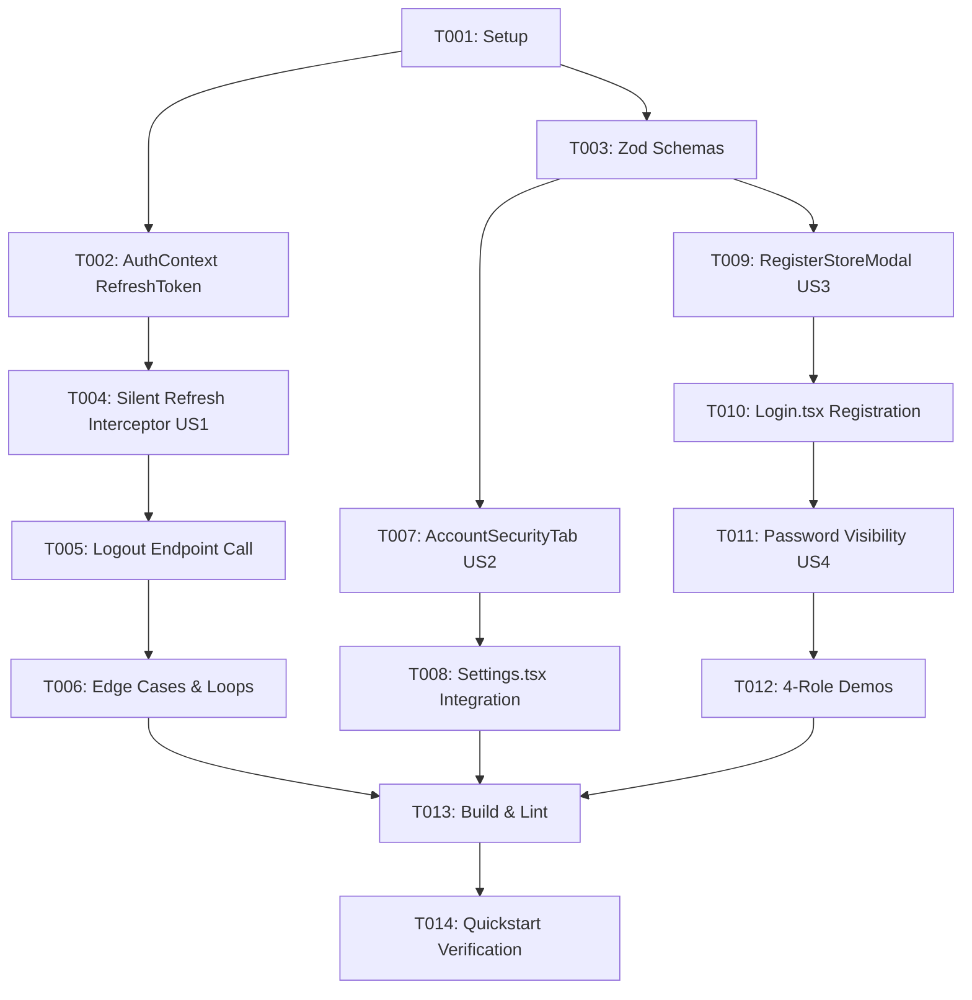

# Tasks: Authentication, Silent Refresh Token & Account Security

**Input**: Design artifacts from `specs/014-auth-security-profile/` (`spec.md`, `plan.md`, `data-model.md`, `contracts/auth-contracts.md`, `research.md`, `quickstart.md`)  
**Status**: Ready

## Phase 1: Setup (Shared Infrastructure)

**Purpose**: Verification and preparation of contracts and runtime environment

- [x] T001 Verify backend authentication endpoints availability and contract schema in `src/api/client.ts`

---

## Phase 2: Foundational (Blocking Prerequisites)

**Purpose**: Core authentication state and validation schemas required by all user stories

- [x] T002 [P] Update `AuthContextType` and token storage to persist `refreshToken` in `src/context/AuthContext.tsx`
- [x] T003 [P] Add Zod validation schemas for change password and store registration in `src/lib/validations.ts`

**Checkpoint**: Foundation ready - User Stories can now be implemented.

---

## Phase 3: User Story 1 - Silent Background Refresh Token Interceptor (Priority: P1) 🎯 MVP

**Goal**: Seamless session persistence without unexpected 15-minute logouts

**Independent Test**: Simulate an expired access token and verify that an API call triggers a silent background refresh, updates storage, and completes the action without kicking the user out.

- [x] T004 [US1] Implement Mutex and Request Queue in `src/api/client.ts` for intercepting 401 errors and calling `/auth/refresh`
- [x] T005 [US1] Update `logout()` in `src/context/AuthContext.tsx` to call `/api/v1/auth/logout` with `{ refreshToken }` and wipe client storage
- [x] T006 [US1] Implement edge cases in `src/api/client.ts` (handle token revocation, avoid retry loops, drain queue on network failure)

**Checkpoint**: User Story 1 complete - Silent session renewal active.

---

## Phase 4: User Story 2 - Account & Security Management in Settings (Priority: P2)

**Goal**: Dedicated "حسابي والأمان" tab in Settings for profile viewing and secure password changes

**Independent Test**: Navigate to Settings -> "حسابي والأمان", view profile card, and test changing password with both invalid and valid credentials.

- [x] T007 [P] [US2] Create `AccountSecurityTab.tsx` with profile card, change password form, and session security card in `src/features/settings/components/AccountSecurityTab.tsx`
- [x] T008 [US2] Integrate the "حسابي والأمان" tab and user icon into `src/pages/Settings.tsx`

**Checkpoint**: User Story 2 complete - Users can manage profile and change credentials.

---

## Phase 5: User Story 3 - Self-Service Store Registration (Priority: P3)

**Goal**: Instant onboarding modal on the login screen to provision a new tenant store and owner account

**Independent Test**: Click "تسجيل متجر جديد" on `/login`, fill in details, submit, and verify direct entry into the dashboard.

- [x] T009 [P] [US3] Create `RegisterStoreModal.tsx` in `src/features/auth/components/RegisterStoreModal.tsx`
- [x] T010 [US3] Integrate registration modal CTA and form handling into `src/pages/Login.tsx`

**Checkpoint**: User Story 3 complete - New merchants/owners can onboard independently.

---

## Phase 6: User Story 4 - Multi-Role Quick Demo & Password UX (Priority: P4)

**Goal**: 1-click demo login for all 4 system roles and password visibility toggling

**Independent Test**: Click the "تاجر الجملة" demo button on `/login` and verify seamless login and automatic redirect to `/portal/catalog`.

- [x] T011 [P] [US4] Add password visibility toggle (Eye/EyeOff icon) to password fields in `src/pages/Login.tsx`
- [x] T012 [US4] Expand demo account buttons in `src/pages/Login.tsx` to support Owner, Manager, Cashier, and Merchant

**Checkpoint**: User Story 4 complete - 1-click testability across all permission tiers.

---

## Phase 7: Polish & Cross-Cutting Verification

**Purpose**: Code quality, build validation, and end-to-end testing

- [x] T013 Run `npm run build` and `oxlint` to guarantee 0 errors across the application
- [x] T014 Execute manual verification scenarios detailed in `specs/014-auth-security-profile/quickstart.md`

---

## Dependencies & Execution Order

